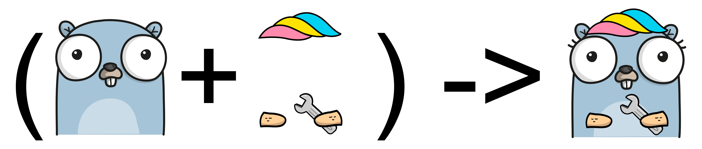

# lo - Iterate over slices, maps, channels...

This project started as an experiment with the new generics implementation. It may look like [Lodash](https://github.com/lodash/lodash) in some aspects. I used to code with the fantastic ["go-funk"](https://github.com/thoas/go-funk) package, but "go-funk" uses reflection and therefore is not typesafe.

As expected, benchmarks demonstrate that generics are much faster than implementations based on the "reflect" package. Benchmarks also show similar performance gains compared to pure `for` loops. [See below](#-benchmark).

In the future, 5 to 10 helpers will overlap with those coming into the Go standard library (under package names `slices` and `maps`). I feel this library is legitimate and offers many more valuable abstractions.

**See also:**

- [samber/do](https://github.com/wilson-aina/do): A dependency injection toolkit based on Go 1.18+ Generics
- [samber/mo](https://github.com/wilson-aina/mo): Monads based on Go 1.18+ Generics (Option, Result, Either...)

**Why this name?**

I wanted a **short name**, similar to "Lodash" and no Go package uses this name.



## 🚀 Install

```sh
go get github.com/wilson-aina/lo@v1
```

This library is v1 and follows SemVer strictly.

No breaking changes will be made to exported APIs before v2.0.0.

This library has no dependencies outside the Go standard library.

## 💡 Usage

You can import `lo` using:

```go
import (
    "github.com/wilson-aina/lo"
    lop "github.com/wilson-aina/lo/parallel"
)
```

Then use one of the helpers below:

```go
names := lo.Uniq([]string{"Samuel", "John", "Samuel"})
// []string{"Samuel", "John"}
```

Most of the time, the compiler will be able to infer the type so that you can call: `lo.Uniq([]string{...})`.

### Tips for lazy developers

I cannot recommend it, but in case you are too lazy for repeating `lo.` everywhere, you can import the entire library into the namespace.

```go
import (
    . "github.com/wilson-aina/lo"
)
```

I take no responsibility on this junk. 😁 💩
